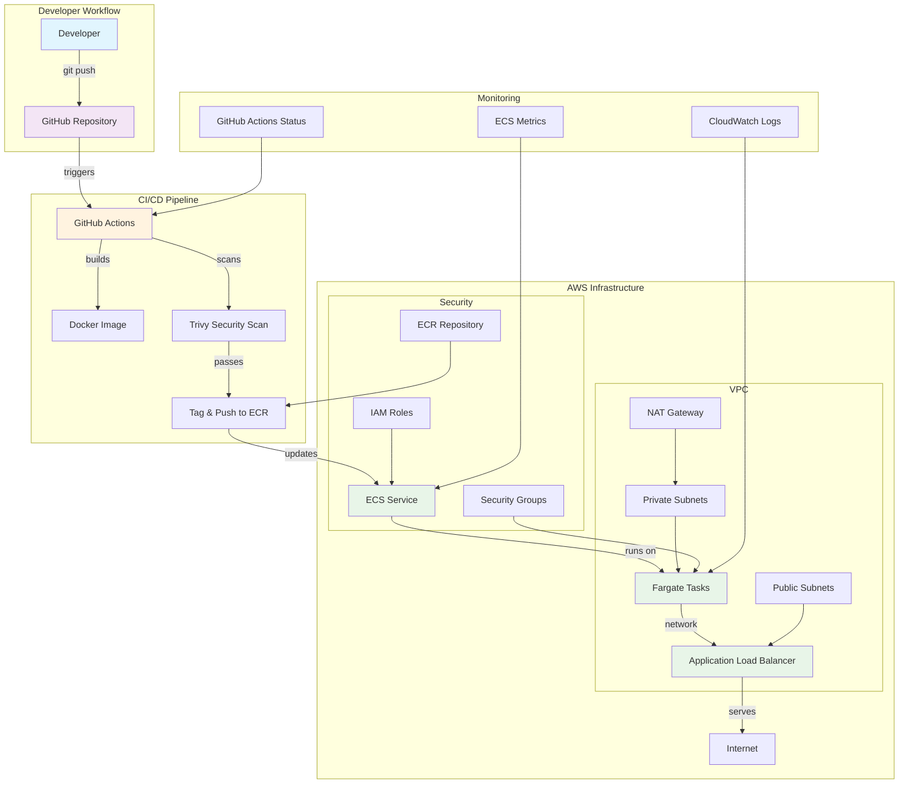

# Architecture Documentation

## System Architecture

## Component Details

### 1. Developer Workflow
- **Developer**: Pushes code to main branch
- **GitHub Repository**: Source code management and version control

### 2. CI/CD Pipeline
- **GitHub Actions**: Automated workflow execution
- **Docker Build**: Multi-stage container image creation
- **Trivy Security Scan**: Vulnerability assessment
- **ECR Push**: Container registry storage

### 3. AWS Infrastructure
- **ECS Service**: Container orchestration service
- **Fargate Tasks**: Serverless compute execution
- **Application Load Balancer**: Traffic distribution and SSL termination
- **VPC**: Network isolation and security
- **IAM Roles**: Least privilege access control
- **Security Groups**: Network-level security

### 4. Monitoring & Observability
- **CloudWatch Logs**: Application and infrastructure logging
- **ECS Metrics**: Performance and health monitoring
- **GitHub Actions Status**: Pipeline execution tracking

## Cost Optimization Strategy

### Serverless Components (Pay-per-use)
- **AWS Fargate**: Only pay for actual compute time
- **Application Load Balancer**: Pay per request/hour
- **CloudWatch Logs**: Pay per GB ingested
- **ECR**: Pay per GB stored

### Free Tier Utilization
- **ECR**: 500MB storage per month
- **CloudWatch**: 5GB log ingestion per month
- **ALB**: 750 hours per month
- **Fargate**: 2 vCPU and 4GB memory per month

### Resource Sizing
- **Development**: 0.25 vCPU, 0.5GB RAM (minimal cost)
- **Production**: 0.5 vCPU, 1GB RAM (scalable)
- **Auto-scaling**: Based on CPU/memory utilization

## Security Architecture

### Network Security
- **VPC**: Isolated network environment
- **Private Subnets**: Application containers run in private subnets
- **Public Subnets**: Load balancer and NAT gateway only
- **Security Groups**: Restrictive inbound/outbound rules

### Access Control
- **IAM Roles**: Service-specific permissions
- **ECR Policies**: Repository access control
- **ECS Task Roles**: Application-level permissions

### Container Security
- **Trivy Scanning**: Automated vulnerability detection
- **Multi-stage Dockerfile**: Minimal attack surface
- **Non-root User**: Container runs as non-privileged user

## High Availability

### Multi-AZ Deployment
- **ECS Service**: Spans multiple availability zones
- **Load Balancer**: Distributes traffic across AZs
- **Auto-scaling**: Handles traffic spikes automatically

### Disaster Recovery
- **ECR**: Container images stored redundantly
- **Terraform State**: Infrastructure as code backup
- **GitHub**: Source code version control

## Performance Optimization

### Container Optimization
- **Multi-stage Builds**: Reduced image size
- **Alpine Linux**: Minimal base image
- **Layer Caching**: Faster build times

### Network Optimization
- **Private Subnets**: Reduced latency
- **NAT Gateway**: Efficient outbound traffic
- **Security Groups**: Optimized rule sets

## Monitoring Strategy

### Application Monitoring
- **Health Checks**: Load balancer health endpoints
- **Log Aggregation**: Centralized logging via CloudWatch
- **Metrics Collection**: ECS service metrics

### Infrastructure Monitoring
- **Terraform State**: Infrastructure drift detection
- **Cost Monitoring**: AWS Cost Explorer integration
- **Security Monitoring**: Trivy scan results tracking 